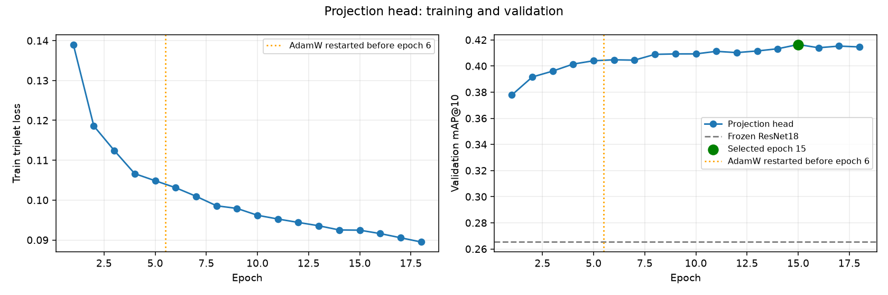
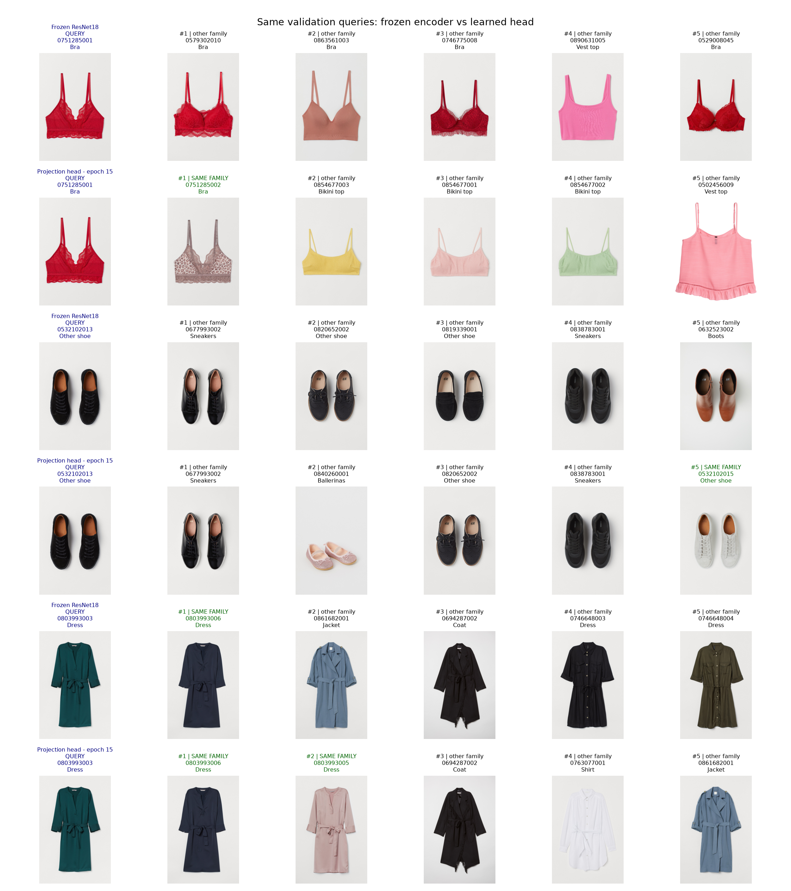
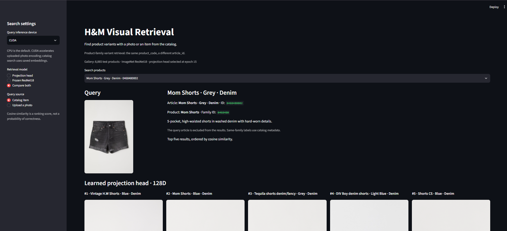
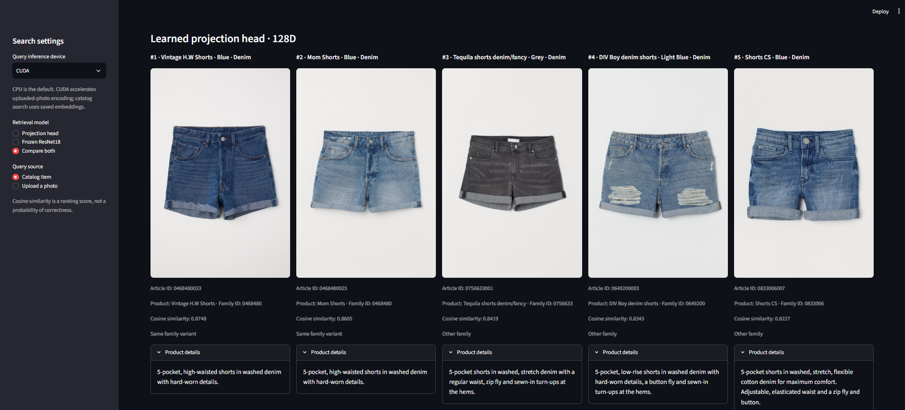
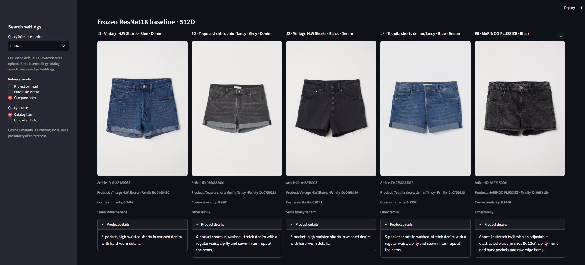

# H&M Visual Retrieval

A visual search project that retrieves different variants of the same
product family from H&M product images.

A frozen, ImageNet-pretrained ResNet18 extracts visual embeddings.
A lightweight projection head trained with triplet loss adapts these
embeddings to product-family retrieval. Products are ranked by cosine
similarity between normalized embeddings.

On the held-out test split, mAP@10 improved from **0.2628 to 0.4098**,
a **56% relative improvement** over the frozen ResNet18 baseline.

## Final Results

| Test metric | Frozen ResNet18 | Projection head | Improvement |
|---|---:|---:|---:|
| mAP@10 | 0.2628 | **0.4098** | +0.1470 |
| Recall@10 | 0.3417 | **0.5139** | +0.1721 |
| HitRate@10 | 0.6160 | **0.7759** | +0.1600 |

For **6,258 of 8,065 test queries**, the top ten results contained
at least one other variant from the same product family.

The model was selected using validation mAP@10:
**epoch 15**, with a validation score of **0.4164**.
Test results were not used for model selection or training decisions.

Full results are available in `reports/test/metrics.json`
and `reports/test/comparison.csv`.

## Dataset and Splits

Dataset: Kaggle — H&M Personalized Fashion Recommendations.

The experiment uses 23,059 product families with at least two
variants that have available images.

| Split | Images | Product families |
|---|---:|---:|
| Train | 64,912 | 18,447 |
| Validation | 8,110 | 2,306 |
| Test | 8,065 | 2,306 |

The split was created at the product-family level with seed 42.
Each `product_code` appears in exactly one split.
Validation and test families are therefore unseen during training.

A retrieved product is considered relevant when it has the same
`product_code` as the query but a different `article_id`.

This is a proxy task for retrieving product-family variants.
It does not measure human-rated fashion similarity or personalized
recommendation quality.

## Method

1. Freeze ResNet18 ImageNet1K V1 weights and remove its classification layer.
2. Convert images to RGB and apply the pretrained weights' standard
   preprocessing: resize the shorter edge to 256, center crop to
   224×224, and apply ImageNet normalization.
3. Extract and cache L2-normalized, 512-dimensional embeddings.
4. Train a bias-free 512→128 linear projection followed by L2 normalization.
   The head contains **65,536 trainable parameters**.
5. Sample up to 64 product families per batch, with two distinct variants
   from each family. The other same-family variant is the positive;
   the nearest different-family item in the batch is the negative.
6. Optimize triplet margin loss with margin 0.2, AdamW learning rate
   0.001, and weight decay 0.0001.

Each epoch visits every training family once and samples two variants.
It does not process all 64,912 training images in every epoch.

The initial training run lasted five epochs. Training then continued
from the learned weights with a new AdamW optimizer and sampling seed 47.
This continuation did not preserve the original optimizer state.

The maximum epoch was 20, with early-stopping patience set to three.
Training stopped at epoch 18, and validation selected epoch 15.

No CNN fine-tuning or random image augmentation was applied.

## Evaluation Protocol

Validation and test queries are evaluated against their respective
complete galleries. The query image itself is excluded from retrieval.

- **Recall@K:** The fraction of relevant gallery images retrieved
  in the top K, averaged across queries.
- **HitRate@K:** The fraction of queries with at least one relevant
  result in the top K.
- **mAP@K:** Mean average precision, accounting for the positions
  of relevant results. The AP denominator is
  `min(K, number of relevant gallery images)`.

mAP is not classification accuracy.

## Learning Curve and Retrieval Examples





The visual comparison uses the same three validation queries for both models.
These examples illustrate retrieval behavior; aggregate metrics measure
overall performance. Incorrect matches remain.

The `test_evaluated: false` field in
`reports/validation/projection_metrics.json` describes the report
at training time. The later, completed final test evaluation is recorded
in `reports/test/metrics.json`.

## Project Files

| File or directory | Purpose |
|---|---|
| `scripts/data.py` | Validate the manifest and resolve local image paths |
| `scripts/demo_retrieval.py` | Load verified local demo assets, encode uploaded queries, and rank cached gallery embeddings |
| `scripts/demo_app.py` | Streamlit catalog search, photo upload, and model comparison |
| `scripts/test_demo_retrieval.py` | Demo cache validation, search behavior, and upload validation tests |
| `scripts/resnet_smoke.py` | Check CUDA and embedding extraction using one image |
| `scripts/resnet_baseline.py` | Evaluate the frozen validation baseline |
| `scripts/cache_train_embeddings.py` | Build the training embedding cache |
| `scripts/train_projection_head.py` | Train the initial five epochs |
| `scripts/continue_projection_head.py` | Continue training with early stopping |
| `scripts/report_validation.py` | Generate the learning curve and retrieval comparison |
| `scripts/evaluate_test.py` | Evaluate the selected checkpoint on the test split |
| `scripts/retrieval_metrics.py` | Shared retrieval metric implementation |
| `scripts/test_retrieval.py` | Metric tests using small, controlled galleries |
| `models/projection_head_epoch15.pt` | Selected projection head checkpoint |
| `reports/` | Saved metrics, training history, and figures |
| `notebooks/kaggle_data_preparation.ipynb` | Original data preparation and SmallCNN exploration |

SmallCNN was an earlier category-classification experiment.
Its weights are not used by the retrieval model, and its classification
accuracy is not directly comparable to retrieval metrics.

## Running the Project

Tested environment: Windows, Python 3.12, PyTorch 2.6.0+cu124,
Torchvision 0.21.0+cu124, and an NVIDIA RTX 3050 Laptop GPU.

The existing training and embedding-extraction scripts require CUDA.
The local demo defaults to CPU and supports CUDA for uploaded-photo encoding.

### Environment Setup

Windows Git Bash:

```bash
python -m venv .venv

./.venv/Scripts/python.exe -m pip install torch==2.6.0 torchvision==0.21.0 --index-url https://download.pytorch.org/whl/cu124
./.venv/Scripts/python.exe -m pip install -r requirements.txt

cp project_config.example.json project_config.json
```

Update `data_root` in `project_config.json` to point to your local
dataset directory.

Expected image layout:

```text
<data_root>/images/010/0108775015.jpg
```

Raw data and embedding caches are not included in the repository.
Obtain the images and `articles.csv` from the Kaggle competition.

To generate the original manifest, upload the data preparation notebook
to Kaggle, attach the H&M competition data, and run only
**code cells 2 and 4**. These cells match articles to available images
and create the product-family split.

Download `/kaggle/working/hm_visual/subset_manifest.csv`
and place it at `artifacts/subset_manifest.csv` locally.

### Pretrained ResNet Weights

Download the official ResNet18 weights into the project's model cache:

```bash
./.venv/Scripts/python.exe -c "import torch; from torchvision.models import ResNet18_Weights; torch.hub.set_dir('model_cache/hub'); ResNet18_Weights.IMAGENET1K_V1.get_state_dict(progress=True, check_hash=True)"
```

### Local Visual Search Demo

#### Demo Preview

The screenshots below show the same catalog query: **Mom Shorts - Grey - Denim**
(`article_id: 0468480002`, `product_code: 0468480`). The query itself is excluded
from the results.

**Catalog query and search controls**



**Learned projection head - 128D**



**Frozen ResNet18 baseline - 512D**



Both models retrieve two same-family variants in this example. The projection
head places them at ranks 1 and 2; the frozen baseline places them at ranks
1 and 3. Other-family matches remain. This selected UI example illustrates
retrieval behavior; the aggregate metrics above describe overall performance.
Cosine scores from the two embedding spaces should not be compared as
probabilities of correctness.

#### Run Locally

From the project root in Windows Git Bash:

```bash
./.venv/Scripts/python.exe -m streamlit run ./scripts/demo_app.py --server.address 127.0.0.1 --browser.gatherUsageStats false
```

Open [http://localhost:8501](http://localhost:8501). Streamlit 1.65.0 is
included in `requirements.txt`.

The demo uses the validation-selected epoch-15 projection head and the
existing **8,065-product test gallery**. Search the catalog by recorded
product name, colour, pattern, or `article_id`. The top five results show
variant names, product names, IDs, family IDs, cosine scores, and available
product descriptions. Names come from the manifest's `prod_name` field;
variant labels include recorded colour and pattern attributes.
The query article is excluded by `article_id`; leading zeros
are preserved. Choose **Projection head**, **Frozen ResNet18**, or
**Compare both** to inspect the same query with either model.

JPG/PNG uploads are limited to 10 MB and 20 million pixels. Images are
decoded in memory, converted to RGB, and processed with the original
ImageNet1K V1 preprocessing. Only the uploaded query is encoded; catalog
queries use saved embeddings. Unreadable or unsupported images show an
error. Uploaded photos are exploratory: published test metrics describe
catalog-variant retrieval, not performance on external photos. Cosine
similarity is a ranking score, not a probability of correctness.

CPU is the default. CUDA can be selected when available to accelerate
uploaded-photo encoding; gallery search uses CPU NumPy arrays. Model and
gallery resources are cached per device across Streamlit reruns, so they
are not reloaded for every query. The existing training scripts' CUDA
requirements remain unchanged.

Required local assets are:

- `project_config.json`, `artifacts/subset_manifest.csv`, and the images
  under the configured `data_root`.
- `models/projection_head_epoch15.pt` and
  `model_cache/hub/checkpoints/resnet18-f37072fd.pth`.
- `results/test_evaluation/frozen_embeddings.npy`,
  `projection_embeddings.npy`, `embedding_rows.csv`,
  `cache_metadata.json`, and `metrics.json`.

The demo validates gallery dimensions and row order, saved cache metadata,
and model/cache checksums. It does not download weights, rebuild the
gallery, or recompute evaluation metrics. These local assets already
exist in the completed experiment; raw CSV files and the dataset ZIP do
not need to be downloaded again. Large caches and source images are not
included on GitHub, so a fresh checkout alone cannot run this demo.

### Evaluate the Saved Model

Check the dataset paths, then copy the selected checkpoint to the location
expected by the evaluation script:

```bash
./.venv/Scripts/python.exe ./scripts/data.py

mkdir -p results/projection_head_v2
cp models/projection_head_epoch15.pt results/projection_head_v2/best.pt

./.venv/Scripts/python.exe ./scripts/evaluate_test.py
```

This workflow extracts test embeddings and computes retrieval metrics.
It does not train the model.

If a completed local test report already exists for the same checkpoint,
the script displays the saved results.

### Reproduce Training

Use a separate, fresh working directory for this workflow:

```bash
./.venv/Scripts/python.exe ./scripts/data.py
./.venv/Scripts/python.exe ./scripts/resnet_smoke.py
./.venv/Scripts/python.exe ./scripts/resnet_baseline.py
./.venv/Scripts/python.exe ./scripts/cache_train_embeddings.py --build --workers 2
./.venv/Scripts/python.exe ./scripts/train_projection_head.py
./.venv/Scripts/python.exe ./scripts/continue_projection_head.py
./.venv/Scripts/python.exe ./scripts/report_validation.py
```

Training scripts refuse to overwrite existing experiment directories.
Finalize model selection using validation before evaluating the test split.

Different hardware or package versions may produce different numerical results.

### Metric and Demo Tests

```bash
./.venv/Scripts/python.exe -m pip install pytest
./.venv/Scripts/python.exe -m pytest ./scripts/test_retrieval.py ./scripts/test_demo_retrieval.py -q --basetemp=./.pytest_cache/demo-tmp
```

For an existing environment managed by `uv` without `pip`, install pytest
with `uv pip install --python ./.venv/Scripts/python.exe pytest` instead.
The tests use controlled fixtures; they do not train a model or recompute
the experiment's retrieval metrics.

## Limitations and Future Experiments

Results come from one data split and one training run.
Each evaluation gallery contains only families in that split
with at least two available images.

Possible future experiments include:

- Extracting new training representations with image augmentation.
- Fine-tuning the final ResNet block.
- Analyzing retrieval errors by category.

CNN fine-tuning has not been implemented. These future experiments are
not part of the reported final results; the local demo uses the existing
frozen encoder and selected projection head.
