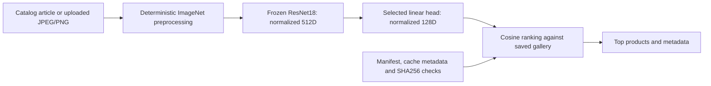

# H&M Visual Retrieval

## Overview

Find different variants of the same product family using a catalog item or an uploaded photo. A frozen ImageNet ResNet18 produces normalized 512D features; a learned 512 → 128 projection head adapts them to family retrieval. Ranking uses cosine similarity.

The selected model is an augmentation-trained continuation of the epoch-15 head. The CNN remains frozen. The Streamlit demo defaults to this head and keeps epoch 15 and the frozen baseline available for comparison.

## Scope and limitations

This is a product-family variant retrieval proxy: the same `product_code`, a different `article_id`. It is not personalized recommendation or verified general fashion similarity. Cosine is a ranking score, not a probability; mAP is not classification accuracy.

Results use one family split and bounded training runs. No uncertainty estimate
or verified external-photo benchmark is provided. Catalog backgrounds, detail
crops, garment category and colour can affect rankings; wrong matches remain.
External uploads are exploratory, and improvement on every photo is not
expected.

Final-block CNN fine-tuning, alternative head dimensions and a labelled external
query set are possible future experiments. They were not used to select this
model. Deployment and an independent API are outside the current local demo.

## Architecture and workflow



Catalog queries use already saved embeddings and exclude their own article. Uploads encode only the new query; the Streamlit demo does not rebuild galleries or download weights. The loader checks the manifest, weights, row order, dimensions, cache metadata and a small head/cache sample before inference. These checks protect the saved experiment; they do not alone establish scientific validity.

The bulk command accepts a separately supplied compatible head and projects the existing frozen gallery in memory. It does not overwrite published gallery files. Detailed training, model selection and robustness protocols are in [EXPERIMENTS.md](docs/EXPERIMENTS.md).

## Project layout

| Directory/file | Purpose |
| --- | --- |
| `src/visual_retrieval/` | Data loading, model/head, ranking, evaluation and demo implementation |
| `scripts/` | Short compatible entry points with explicit imports |
| `docs/` | Setup, experiment details, previews and verification evidence |
| `models/` | Original epoch-15 and selected augmented inference checkpoints |
| `reports/validation`, `reports/test` | Preserved original experiment reports |
| `reports/robust_head` | Continuation configuration, history, validation and final test reports |
| `reports/uploads` | HTML preview, screenshots and qualitative summary |
| `reports/classification` | Separate SmallCNN/majority-baseline exploration |
| `notebooks/` | Original Kaggle data preparation and classification exploration |
| `project_config.example.json` | Copy to local `project_config.json` to point at your assets |
| `artifacts/`, `results/`, `model_cache/` | Local manifest, experiment caches and weights; ignored by Git |

No package `__init__.py` files are required. Entry points add `src` to the import path and import named functions from the `visual_retrieval` namespace. `__init__` methods inside model classes are constructors and remain part of the model.

## Data and artifacts

The source dataset is Kaggle's H&M Personalized Fashion Recommendations. Images, the manifest and large feature caches are local assets excluded from Git. A fresh checkout alone cannot run the complete demo. [SETUP.md](docs/SETUP.md) lists every required asset and the paths expected by the code.

Committed checkpoints, report files, screenshots and notebooks keep their original bytes. SmallCNN was a separate classification exploration; its weights are not used by retrieval and its accuracy/F1 are not compared directly with retrieval mAP.

## Setup

Run from the project root in Windows Git Bash:

```bash
python -m venv .venv
./.venv/Scripts/python.exe -m pip install torch==2.6.0 torchvision==0.21.0 --index-url https://download.pytorch.org/whl/cu124
./.venv/Scripts/python.exe -m pip install -r requirements.txt
cp project_config.example.json project_config.json
```

Set `data_root` and `manifest` to your existing local assets. The recorded gallery is bound to PyTorch 2.6.0+cu124 and the original encoder/preprocessing signature; do not present an arbitrary newer environment as an equivalent historical run. CPU inference is supported in that runtime; training/extraction scripts require CUDA.

The recorded development environment is in `requirements-lock.txt`; it includes notebook dependencies and has had automated test/lint tools removed. It is not a minimal runtime lock. [SETUP.md](docs/SETUP.md) preserves the full asset acquisition instructions and original measured environment.

## Usage

```bash
./.venv/Scripts/python.exe -m streamlit run ./scripts/demo_app.py --server.address 127.0.0.1 --browser.gatherUsageStats false
```

Open [http://localhost:8501](http://localhost:8501). Search catalog products by recorded name, colour, pattern or ID; upload a JPEG/PNG; choose robust/epoch-15 head or compare the chosen head with the frozen baseline. Upload limits are 10 MB and 20 million pixels; images remain in memory.

```bash
./.venv/Scripts/python.exe ./scripts/evaluate_bulk_upload.py \
  --input results/upload_photos_v1 \
  --checkpoint models/projection_head_robust.pt \
  --device cpu --top-k 10 --output results/upload_selected_new
```

Use a new/empty output directory or add `--check-only` for asset/label preflight without inference or file creation. Bulk outputs include `preview.html`, `predictions.csv`, `summary.json` and `errors.csv`. The bulk command's default checkpoint remains epoch 15; the command above explicitly selects the robust head.

[DEMO.md](docs/DEMO.md) preserves catalog and external-upload screenshots, valid/mixed/failure examples and the saved HTML preview. [EXPERIMENTS.md](docs/EXPERIMENTS.md) preserves all scientific reproduction commands and the verified-label CSV schema. There is no independent HTTP/FastAPI endpoint in this project; [API_REVIEW.md](docs/API_REVIEW.md) describes demo and output behavior.

## Evaluation protocol

Source: Kaggle's H&M Personalized Fashion Recommendations dataset. The subset
contains **23,059 families**, each with at least two available article images.

| Split | Images | Families |
| --- | ---: | ---: |
| Train | 64,912 | 18,447 |
| Validation | 8,110 | 2,306 |
| Test | 8,065 | 2,306 |

Families were split with seed 42; each `product_code` belongs to exactly one
split. Validation/test families do not update model weights. Full catalog
validation uses all 8,110 images; full test uses all 8,065 images.

- **Recall@K:** retrieved relevant images divided by all relevant gallery
  images, averaged across queries.
- **HitRate@K:** queries with at least one relevant result in the first K.
- **mAP@K:** mean average precision, accounting for ranking positions. The AP
  denominator is `min(K, number of relevant gallery images)`.

This is a **product-family variant retrieval proxy**, not personalized
recommendation or human-labelled general fashion similarity. mAP is not
classification accuracy.

Controlled query transformations use one query per validation family and the unchanged validation gallery; those results are separate from all-image catalog evaluation. External unlabelled uploads have no retrieval accuracy metric. Published test reuse, optimizer restart, clean-score guard and the absent unaugmented continuation control are documented in [EXPERIMENTS.md](docs/EXPERIMENTS.md).

## Results and interpretation

All 8,065 test images serve as both queries and gallery items. Each query's own
article is excluded; relevance means **same `product_code`, different
`article_id`**.

| Test metric | Frozen ResNet18 | Epoch-15 head | Selected augmented head |
| --- | ---: | ---: | ---: |
| mAP@10 | 0.262773 | 0.409823 | **0.417074** |
| Recall@10 | 0.341722 | 0.513853 | **0.523485** |
| HitRate@10 | 0.615995 | 0.775945 | **0.788841** |

The selected head improves mAP@10 by **1.77% relative to epoch 15** and by
**58.72% relative to the frozen baseline**. The top ten contain another
same-family variant for **6,362 / 8,065** queries, compared with 6,258 for epoch 15.

Checkpoint selection used validation only. The original test results had
already been evaluated and published before augmented continuation. The later
comparison reuses that test split; it is **not a new blind test**. Test scores
were not used to choose the continuation epoch or tune its hyperparameters.

Original reports remain in [reports/test](reports/test).
Continuation reports are in [reports/robust_head](reports/robust_head).

The robust-head validation table, original learning curve and external-photo failure examples remain in the focused experiment/demo documents. Architecture cleanup does not create a new model result or a new blind evaluation.

## Verification

The 2026-10-09 layout/readability pass compares the published source commit `484a835e0c3cc072ad6b90e4731f4ecefefe3ca2` with this working copy. It uses the completed local weights and caches on CPU and records its bounded checks in [VERIFICATION_RESULTS.json](docs/VERIFICATION_RESULTS.json).

Twenty-four catalog queries per head, each under frozen/projected search, and all 13 existing unlabelled upload photos per head keep exact vectors/ranking outputs under the same runtime. Six deterministic robustness transformations, family sampling and hard-triplet helpers are also checked. All 26 committed checkpoint/report/notebook files retain their bytes. No training, downloads, gallery regeneration or new automated test suite was performed. This does not substitute for a new full experiment or establish external-photo accuracy.

Software test suites, Docker files and package initializer files are not distributed. Scientific `evaluate_test.py`, test-split data/protocols and `reports/test` remain because they document ML evaluation. Error handling and CLI/import checks are scoped in [API_REVIEW.md](docs/API_REVIEW.md).

## Design choices

The code uses plain functions and a PyTorch projection-head class. Cosine, triplet and retrieval calculations use vector operations. Compatibility entry points retain the original command paths.
