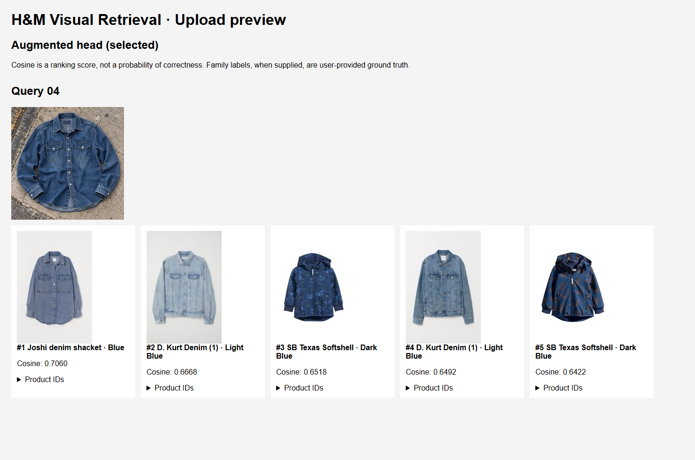
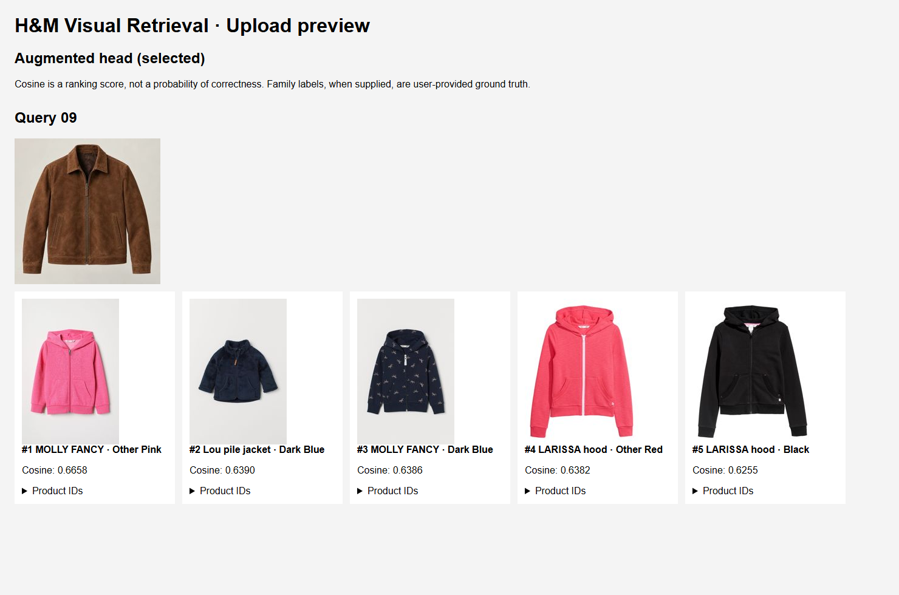
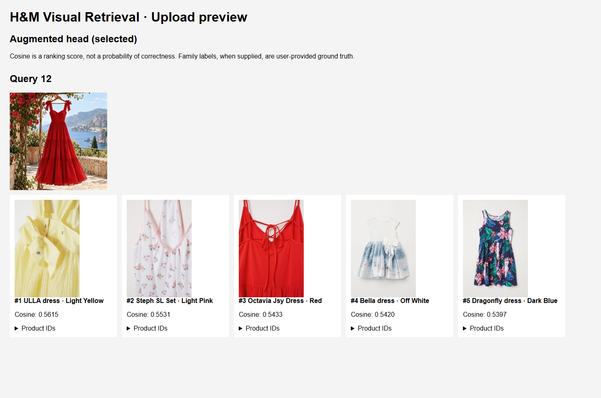

# Local demo and qualitative previews

Run from the project root in Windows Git Bash:

```bash
./.venv/Scripts/python.exe -m streamlit run ./scripts/demo_app.py --server.address 127.0.0.1 --browser.gatherUsageStats false
```

Open [http://localhost:8501](http://localhost:8501). If the app is already running
when the code changes, stop it with Ctrl+C and restart it.

- Search 8,065 catalog products by recorded name, colour, pattern or article ID.
- Upload a JPG/PNG, then inspect the five highest-ranked products.
- Switch between the **selected augmented head** and the **original epoch-15
  head**. Compare the chosen head with the frozen 512D baseline.
- Product cards display names, variant attributes, cosine scores and details.
  Catalog queries exclude their own article ID, preserving leading zeros.

CPU is the default. CUDA accelerates uploaded-photo encoding when available;
catalog search uses saved embeddings. Models and galleries are cached per
device and head version. Uploaded-query caches also distinguish the selected
head, so switching models cannot reuse the other head's query embedding.

Uploads accept JPEG/PNG up to **10 MB and 20 million pixels**. Images are decoded
in memory, EXIF orientation is applied, and the original deterministic ImageNet
preprocessing is used. Unreadable images produce an error. Cosine similarity
is a ranking score, **not a probability of correctness**.

### Catalog preview

These original epoch-15 screenshots show **Mom Shorts · Grey · Denim**
(`0468480002`, family `0468480`). They document the earlier demo; the current
default is the augmented head. Both original models find two same-family
variants in this selected example. Aggregate metrics describe overall results.


<details>
<summary>Original epoch-15 and frozen-baseline results</summary>


</details>

### External upload preview

Both heads processed the **same 13 unlabelled photos**, with no decoding errors.
The images' product families were not verified, so **no upload mAP, Recall or
HitRate was calculated**. Nine queries had the same first result under both
heads; this is ranking agreement, not accuracy. These examples illustrate
behavior and limitations, not measured general fashion similarity.

The screenshots below come from the selected head's saved HTML preview and show
its top five results. Long source filenames are hidden; product IDs remain
available in expandable details.

**Denim shirt: visually related shirts appear near the top.**



**Failure example: a brown jacket retrieves hoodies and unrelated outerwear.**



**Mixed example: a red dress retrieves a red dress detail at rank three,
alongside different colours and designs.**



[Full selected-head HTML preview](../reports/uploads/preview.html) ·
[Qualitative summary](../reports/uploads/summary.json)

Download the HTML file and open it locally; its thumbnails are embedded and it
needs no server. GitHub shows HTML as source rather than embedding this app in
the README. Original photo-to-result mappings remain in local prediction CSVs.
